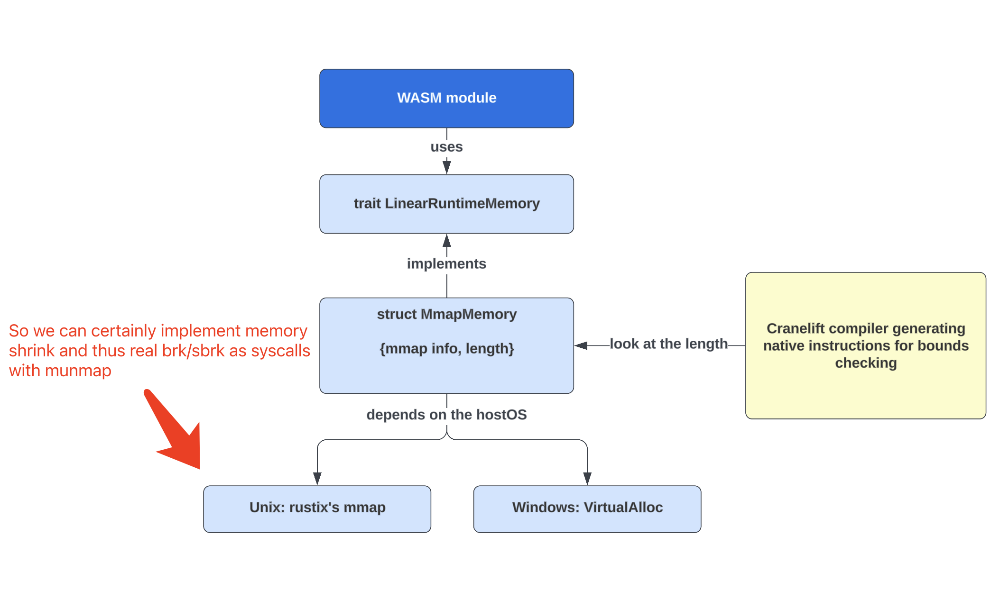
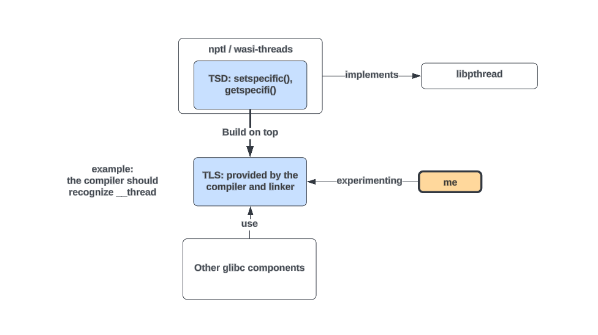
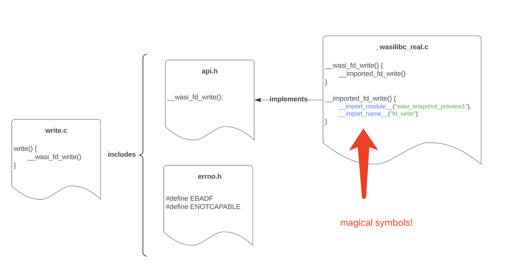

# Daily Progress Log

## Mon 7/01/2024
1. wasm-ld: error: ../../glibc/sysroot/lib/wasm32-wasi/libc.a(pthread_create.o): undefined symbol: __futex_abstimed_wait_cancelable64
This error is fixed by disabling INTERNAL_SYSCALL_CANCEL for futex_time64 in /glibc/nptl/futex-internal.c
2. wasm-ld: error: ../../glibc/sysroot/lib/wasm32-wasi/libc.a(pthread_rwlock_rdlock.o): undefined symbol: __futex_abstimed_wait64
This error is fixed by disabling INTERNAL_SYSCALL_CANCEL for futex (__futex_abstimed_wait_common32) in /glibc/nptl/futex-internal.c
3. wasm-ld: error: ../../glibc/sysroot/lib/wasm32-wasi/libc.a(fileops.o): undefined symbol: __open 
This error is fixed by changing the implementation of __libc_open to return MAKE_SYSCALL(10, "syscall|open", (uint64_t) file, (uint64_t) oflag, (uint64_t) mode, NOTUSED, NOTUSED, NOTUSED); in /glibc/sysdeps/unix/sysv/linux/open.c
4. wasm-ld: error: ../../glibc/sysroot/lib/wasm32-wasi/libc.a(pthread_mutex_unlock.o): undefined symbol: __lll_unlock_elision
This error is fixed by disabling _xend() ''hardware unlock'' in /glibc/sysdeps/unix/sysv/linux/x86/elision-unlock.c
5. wasm-ld: error: ../../glibc/sysroot/lib/wasm32-wasi/libc.a(pthread_mutex_lock.o): undefined symbol: __lll_lock_elision
This error is fixed by disabling xbegin() /glibc/sysdeps/unix/sysv/linux/x86/elision-lock.c
6. Now, both pthread and hello-world can be compiled successfully 

## Fri 6/28/2024
1. wasm-ld: error: ../../glibc/sysroot/lib/wasm32-wasi/libc.a(dl-reloc.o): undefined symbol: _dl_lookup_symbol_x 
Fix above error by changing int gscope_flag; to _Atomic int gscope_flag; in /glibc/sysdeps/i386/nptl/tls.h
2. wasm-ld: error: ../../glibc/sysroot/lib/wasm32-wasi/libc.a(ldbl2mpn.o): undefined symbol: __clz_tab
Fix above error by adding implementation of unsigned char __clz_tab[] in /glibc/sysdeps/i386/mp_clz_tab.c
3. wasm-ld: error: ../../glibc/sysroot/lib/wasm32-wasi/libc.a(stat64.o): undefined symbol: __fstatat64_time64
This error is fixed by disabling fstatat64_time64_stat in /glibc/sysdeps/unix/sysv/linux/fstatat64.c for now

## Thu 6/27/2024
1. Change the implementation of thread_self to wasi-libc version, which fixed errors:
wasm-ld: error: ../../glibc/sysroot/lib/wasm32-wasi/libc.a(pthread_join_common.o): undefined symbol: __wasilibc_pthread_self
wasm-ld: error: ../../glibc/sysroot/lib/wasm32-wasi/libc.a(pthread_join_common.o): undefined symbol: __wasilibc_pthread_self
wasm-ld: error: ../../glibc/sysroot/lib/wasm32-wasi/libc.a(pthread_join_common.o): undefined symbol: __wasilibc_pthread_self
wasm-ld: error: ../../glibc/sysroot/lib/wasm32-wasi/libc.a(pthread_join_common.o): undefined symbol: __wasilibc_pthread_self
wasm-ld: error: ../../glibc/sysroot/lib/wasm32-wasi/libc.a(pthread_join_common.o): undefined symbol: __wasilibc_pthread_self
wasm-ld: error: ../../glibc/sysroot/lib/wasm32-wasi/libc.a(pthread_join_common.o): undefined symbol: __wasilibc_pthread_self
wasm-ld: error: ../../glibc/sysroot/lib/wasm32-wasi/libc.a(pthread_join_common.o): undefined symbol: __wasilibc_pthread_self
2. wasm-ld: error: ../../glibc/sysroot/lib/wasm32-wasi/libc.a(gconv_dl.o): undefined symbol: __libc_dlopen_mode
Fixed above error by disabling the // args.caller_dlopen = RETURN_ADDRESS (0);
3. wasm-ld: error: ../../glibc/sysroot/lib/wasm32-wasi/libc.a(dl-debug.o): undefined symbol: _r_debug_extended
This error is fixed by converting dl-debug-symbols.S to dl-debug-symbols.c
4. wasm-ld: error: ../../glibc/sysroot/lib/wasm32-wasi/libc.a(rtld_static_init.o): undefined symbol: __dlopen
wasm-ld: error: ../../glibc/sysroot/lib/wasm32-wasi/libc.a(rtld_static_init.o): undefined symbol: __dlsym
wasm-ld: error: ../../glibc/sysroot/lib/wasm32-wasi/libc.a(rtld_static_init.o): undefined symbol: __dlvsym
wasm-ld: error: ../../glibc/sysroot/lib/wasm32-wasi/libc.a(rtld_static_init.o): undefined symbol: __dlmopen
Above error are fixed by #define RETURN_ADDRESS(nr) (NULL) in /glibc/include/libc-symbols.h

## Wed 6/26/2024
1. The build and run pipeline has been tested and works well
2. To compile threading testcase, we are facing below errors:
wasm-ld: error: ../../glibc/sysroot/lib/wasm32-wasi/libc.a(gconv_dl.o): undefined symbol: __libc_dlopen_mode
wasm-ld: error: ../../glibc/sysroot/lib/wasm32-wasi/libc.a(gconv_dl.o): undefined symbol: __libc_dlsym
wasm-ld: error: ../../glibc/sysroot/lib/wasm32-wasi/libc.a(gconv_dl.o): undefined symbol: __libc_dlsym
wasm-ld: error: ../../glibc/sysroot/lib/wasm32-wasi/libc.a(gconv_dl.o): undefined symbol: __libc_dlsym
wasm-ld: error: ../../glibc/sysroot/lib/wasm32-wasi/libc.a(gconv_dl.o): undefined symbol: __libc_dlclose
wasm-ld: error: ../../glibc/sysroot/lib/wasm32-wasi/libc.a(ldbl2mpn.o): undefined symbol: __clz_tab
wasm-ld: error: ../../glibc/sysroot/lib/wasm32-wasi/libc.a(ldbl2mpn.o): undefined symbol: __clz_tab
wasm-ld: error: ../../glibc/sysroot/lib/wasm32-wasi/libc.a(ldbl2mpn.o): undefined symbol: __clz_tab
wasm-ld: error: ../../glibc/sysroot/lib/wasm32-wasi/libc.a(ldbl2mpn.o): undefined symbol: __clz_tab
wasm-ld: error: ../../glibc/sysroot/lib/wasm32-wasi/libc.a(ldbl2mpn.o): undefined symbol: __clz_tab
wasm-ld: error: ../../glibc/sysroot/lib/wasm32-wasi/libc.a(ldbl2mpn.o): undefined symbol: __clz_tab
wasm-ld: error: ../../glibc/sysroot/lib/wasm32-wasi/libc.a(ldbl2mpn.o): undefined symbol: __clz_tab
wasm-ld: error: ../../glibc/sysroot/lib/wasm32-wasi/libc.a(ldbl2mpn.o): undefined symbol: __clz_tab
wasm-ld: error: ../../glibc/sysroot/lib/wasm32-wasi/libc.a(ldbl2mpn.o): undefined symbol: __clz_tab
wasm-ld: error: ../../glibc/sysroot/lib/wasm32-wasi/libc.a(ldbl2mpn.o): undefined symbol: __clz_tab
wasm-ld: error: ../../glibc/sysroot/lib/wasm32-wasi/libc.a(ldbl2mpn.o): undefined symbol: __clz_tab
wasm-ld: error: ../../glibc/sysroot/lib/wasm32-wasi/libc.a(ldbl2mpn.o): undefined symbol: __clz_tab
wasm-ld: error: ../../glibc/sysroot/lib/wasm32-wasi/libc.a(ldbl2mpn.o): undefined symbol: __clz_tab
wasm-ld: error: ../../glibc/sysroot/lib/wasm32-wasi/libc.a(pthread_mutex_unlock.o): undefined symbol: __lll_unlock_elision
wasm-ld: error: ../../glibc/sysroot/lib/wasm32-wasi/libc.a(pthread_create.o): undefined symbol: __libc_sigaction
3. Add implementation to handle sigaction syscall in both rustposix and glibc

## Tue 6/25/2024
1. Give Runbin access to server, and let him play around
2. Add document to compile wasmtime from source code
3. Try to run the whole pipeline, and fix some documentation 
4. Continue working on threading part, now trying to compile pthread_create.c and remove the asm code
5. Now we have pthread_create.o generated

## Mon 6/24/2024
**Summary**: Migrated `glibc` `wasmtime` `lind-wasm-docs` `lind-wasm-tests` from `yizhuoliang` to `Lind-project` org, note that wasm adapted rustposix is still on `yzhang71`'s fork, the `3i-dev` branch.

Downside of git submodules is keep tracking of branches seperately. Currently, the latest branches are:

- `glibc` is on `syscall-retrun`, yes, ret"run", a typo
- `wasmtime` is on `add-lind`
- tests, and docs are using `main`

## Wed 6/19/2024
**Summary**: So today we implemented `brk`/`sbrk` in glibc (userspace), by over allocating to page-aligned address and exposing a “psudo-break” to the caller. Now malloc is fully functional for small chunks that uses sbrk!

When larger chunks are requested, the mmap path of malloc is triggerred. `mmap` is not yet handled.

A side note is that, later we should bring `brk`/`sbrk` to the runtime space as syscalls, and add a mutex to the “psudo-break”, otherwise race conditions are still possible under current implementation.

## Mon-Tue 6/17-18/2024
Looking at how are LinearMemory instances provisioned by the runtime, will include these in a seperate document.



In Wasmtime, the WASM module’s linear memory is implemented by `MmapMemory` struct, which is a simple struct contains a `mmap` struct and a mutable `length`. The compiler (i.e. interpreter) do bounds checking according to the `length` field, **so any address above `length` would be invalid**. The `mmap` struct is implemented differently for different host OS. For linux, it’s just the mmap provided by rustix  library. Note that they almost never use a “file” for mmap, here mmap is just used to allocate memory.

## Fri 6/14/2024
**Summary**: Transitioned from Wasmer to Wasmtime, and added userspace debugging document. Also fixed the syscall return value at the interface between glibc and runtime.

**What's next**: Find someway to implement `brk`/`sbrk` in the runtime as host functions.

About host functions:
Currently the `lind_syscall` host function is integrated within the `wasi_snapshot_preview1` interface, along with the `fd_write` stuff. I added this to preview1 for simplicity, where only the `from_witx!` and the witx file need to be changed. In the longer term we want to seperate lind_syscall with other wasi host functions of course.

About function return of host functions:
In wasi-libc and Wasmtime (also Wasmer), the host functions doesn't return the values to the userspace caller directly. 
The last argument in the import signature (e.g. `__imported_wasi_snapshot_preview1_fd_write` in `wasi-libc`) is actually a pointer to the return value. When I implemented `lind_syscall` host function, the last argument in the import signature is also an `unsigned int`, where in the userspace I firstly decalre `int ret = 0`, then pass `&(unsigned int) ret` as the last argument. And copying the value returned by the actual `lind_syscall` in Wasmtime to the `ret` happens implicitly.

## Wed 6/12/2024
**Summary**: Consecutive syscalls okay in Wasmer (lind init in `run_wasm`). Added complete syscall support for malloc, except `brk`/`sbrk`.

**Issues**: 1) **malloc fails after several mmap/munmap calls, hard to debug** 2) the `brk` syscall needs special handling, where `wasi-libc` is implemented with the compiler emitted function `__builtin_wasm_memory_grow`. Note that currently lind's `brk` is managed by NaCl.

**What's next**: We _**MUST**_ find a way to trace/debug the wasm runtime's user space. We are currently exploring both Wasmer and Wasmtime's potential to do this. The `brk` need more investigation.

Wasmer has a "DWARF debugging repo here https://github.com/wasmerio/wasm-debug. [Well okay, this is way too obsolete]

Wasmtime's doc on debugging https://github.com/bytecodealliance/wasmtime/blob/main/docs/examples-debugging-native-debugger.md

trying to understand both

## Tue 6/11/2024
**Summary**: `malloc-hello` compiles successfully, Wasmer also validate the module successfully.

**What's next**: the program fails after the first syscall to lind, as the initial modifications to Wasmer doesn't support consecutive syscalls. I'll update Wasmer to support consecutive syscalls, and Dennis will adapt more syscalls in glibc / rustposix.

Adapted `writev` and `munmap` in glibc to use lind syscalls. Add rustposix new dispatcher support for these 2 calls.

When we removed assembly implementations earlier, we added dummy replacement functions with argument types of `uint64_t`, which was absolutely wrong. We should just use standard posix arguments here, and the type conversion to `i64` is done by our `MAKE_SYSCALL` macro.

Added the WASM program compilation doc.

### Starting this Doc Today!
--- **BELOW WILL BE JUST SLACK MESSAGE HISTORIES** :) ---

## Mon 6/10/2024
Coulson:

As a first step to resolve the glibc’s internal use of TLS `initial-exec` model, I just made two changes
- I replaced the TLS variable attributes and root-level makefile to use `local-exec`, which is supported by WASM compiler
- In glibc/locale directory, many files use the national locale `NL_CURRENT_DEFINE` macro, which contains some assembly doing value assignment and variable visibility setting. The use of assembly here is completely unnecessary, so I replaced the macro definition with plain C, with the same effect. See this [commit](https://github.com/yizhuoliang/glibc/commit/2ad9c05ef79e00ffcdc44df7a837b7e42cfc45c1)

After these changes, the `_nl_current_LC_CTYPE_used` issue I posted in this channel on June 2nd, is resolved.

## Fri-Sat 6/7-8/2024
Coulson:

So I carefully reviewed `native_client`’s TLS related code, and compared normal glibc’s i386 tls.h file with `nacl-glibc`’s i386.h file (note that both nacl and ours are actually using i386 in glibc). Here’s the conclusion:
NaCl doesn’t manage TLS variables at all, both `NaClSysTlsInit` and `NaClSysTlsGet` are actually used to get the pointer to the TLS_base. Like I reported yesterday, x86 uses the `gs`/`fs` register to store the pointer to the TLS_base. Because NaCl is cross platform, and this `gs` register doesn’t exist on some arch, NaCl just use these two syscalls to mimic this register.

## Thu 6/6/2024
Added the TLS doc.

Coulson:

So I wrote a note. Now I know how the compiler and linker handles TLS even without threading, they expose 2 constants, 1 mut var, and 1 function to the threading library. Also understood how is `wasi-libc` pthread library built on-top-of these. Although I wrote this doc with wasm environment as examples, the general mechanisms are the same for normal linux.

## Wed 6/5/2024


Coulson:

An super important distinction between TLS and the threading library’s TSD need our attention

- TLS: provided by the compiler and linker, exists even without pthread library at all.
- TSD: (thread specific data): this is the interface provisioned by the pthread  library, which is implemented by nptl  (also wasi-libc  threading built). This includes the getspecific()  and setspecific()  functions. In both glibc ’s nptl  and the wasi-libc  case, these are build on-top-of TLS

## Sat, 6/1/2024

First time seeing the series of errors related to `initial-exec` absolute addressing

```
wasm-ld: error: /glibc/sysroot/lib/wasm32-wasi/libc.a(wcsmbsload.o): undefined symbol: _nl_current_LC_CTYPE
```

## Wed, 5/29/2024

Coulson:

A sidenote here, when we use clang  with WebAssembly target, if we are building a library, we need the -c  flag. Without -c , we are building an executable whose functions will not be shared.

Also some exiting updates here

- Now using our wasm glibc’s sysroot to compile a simple hello world, the secondary compilation in Wasmer is also passed! The only thing left is to refine the
Wasmer’s host function interface connecting to rustposix, which is easy.
- I implemented the WASM syscall interface inside glibc, as a separate directory at /glibc/lind_syscall
- I implemented a shell script that can generate a WASM sysroot from the glibc’s building directory by one command

Dennis:

Some updates from my side, I have implemented write, read, close, access and open syscalls to be used for "hello world" example from Coulson side.

Coulson:

We can run a write-syscall-only hello world succesfully, from our WASM glibc, to the generic lind syscall interface added in Wasmer, to the new 3i-style layer newly implemented by Dennis in rustposix!

## Mon-Tue, 6/27-28/2024

Sepnt some time on debugging the

```
error: Unable to compile "newhello.wasm"
╰─▶ 1: Validation error: type mismatch: values remaining on stack at end of block (at offset 0x26a)
```

The way to solve similar issues was added to the WASM compile doc.

## Fri, 5/24/2024

Start to add

- wasmer should pass linear mem start addr to rustposix
- rustposix should have the 3i style layer that do the address translation

## Thu, 5/23/2024
Coulson:

Now we further cleared the errors, now it’s 1827 errors, and Zero Segfaults.

The `SINGLE_THREAD_P` issue were due to mismatch of .c and other stuff, because we deleted the asm, the malloc fall down to the generic implementation, while the header file actually included is still the sysdep one. After deleting the sysdep header to force using generic header file, many errors were resolved

As a result, now we also have the full malloc library!

## Wed, 5/22/2024
Coulson:

(Disable PLT bypassing) Well now we are constantly shrinking the set of errors and gets more .o files. This morning we have 65000 errors, but now it’s 4500.

## Mon, 5/20/2024
Coulson:

So, now the entire string library is complete, after further clean-up asm stuff. And the 4000 seg faults, now only 139 remains.

**Note that we are now cleaning the asm not in the sysdeps directories!**

But note that there are still countless compilation errors out there. This also makes sense because if we compare this wasm32 built with a normal complete built, we can see that any fancy stuff (like single-instruction-multiple-data) just failed (or disabled) during the process as expected, but this doesn’t bother we get the rest done. So these are okay errors

## Fri-Sun, 5/17-19/2024

So dennis today fixed a handful clang segfault occurrences by trial-and-error on various includes, in a case-by-case manner. For example, `csu/check_fds.c` gets `#include <not-cancel.h>` removed, then it compiles

and `csu/init_first.c` gets sysdep.h libc-internal.h ldsodefs.h  removed, then it compiles
But I saw that there are still 3903 such seg fault, throughout the compilation process, not just the csu part, so handling each of them one by one is not plausible, and I was doing some DFS on this issue, hoping we can get to know, what specifically is causing the clang segfault.

I spent a few hours trying to track down the issue, and I doubt it’s still because some assembly code out there. Here’s the reason. Initially, compiling csu/check_fds.c  would cause the segfault, where `csu/check_fds.c` includes `sysdeps/unix/sysv/linux/not-cancel.h` which includes the sysdep.h implemented at sysdeps/unix/i386/sysdep.h , which contains bunch of assembly macros, and further includes other sysdep.h files contains assembly macros.

Then, if we clear this sysdeps/unix/i386/sysdep.h , the segfault for csu/check_fds.c goes away.

The problem is that, for the next file `csu/init_first.c` causing segfault, removing the sysdep.h includes is needed but not enough. We definitely need to explore this more, there’s still a lot of confusions. These are the hints we have so far.

Ah Ha!

Okay, I know what’s the clang bug here. There are some occurrences of using inline asm to do symbol aliasing, like, `__asm__ ("mempcpy = __GI_mempcpy");`

when the clang compiler set with wasm target sees this, it won’t raise any error but simply get a segmentation fault

If I put this one line into a c file, then trying to compile it simply trigger exactly the same seg fault we see through out the compilation process 

Then people will ask, why I and Dennis missed these inline asm? :joy: (edited) 

Because they are not in the sysdeps directly, but in the glibc/include directory. Because stuff like symbol aliasing are not arch specific though it is indeed assembly, and when I firstly started the sanitization I supposed all assembly are arch specific. I only realized this after hours and hours of inspection.

Now we will sanitize the glibc/include, then I think we can have a leap on the compilation.

## Tue, 5/14/2024

Dennis:

At this stage, we have removed the in-line asm in glibc as well. But when compiling with wasm32, we encountered error: clang frontend command failed with exit code 139 (use -v to see invocation and it seems like we triggered a bug in llvm.

Coulson:

Start using `--keep-going` to skip the seg faults. Also tested that the individual wasm object files are indeed usable.

## Tue, 4/30/2024
Justin:

I've thought some more and think the macro call in glibc should look like this (I don't care what you name the macro):
`MAKE_SYSCALL(syscallnum,"syscall|callname", arg1, arg2, arg3, arg4, arg5, arg6)`

with write looking like:
`MAKE_SYSCALL(2,"syscall|write", (uint64)fd, (uint64)buf, (uint64)len, NOTUSED, NOTUSED, NOTUSED)`
NOTUSED should be defined to be a magic value that will be obviously not a normal value (avoiding NULL, 0, 1, etc.) if it shows up in a debugger / output, it is not confused for a user passed value.  Something like 0xdeadbeefdeadbeef.
My rationale for having this slightly more complex macro is that later on if we decide we want to switch to keying them based upon strings instead of numbers, this will be much easier.  It also isn't any different from an efficiency standpoint, since the preprocessor will just strip out the string if we don't use it.

## Thu, 4/25/2024
Coulson:

The fundamental way that wasi-libc  implements a syscall and declare that symbol for compiler/runtime is clear to me now, basically the the `__import_module__` and `__import_name__` are the magical symbols that has NO DEFINITION. So these should be the `wasi-libc`’s secrete signals to tell the WASM compiler and runtime what external symbol it needs.



Dennis:

Note that the import namespace and function name should be align with the how the runtime exports them. e.g. how Wasmer exports `wasi_smapshot_preview1`

## The Wild Age
This project started in March, 2024.

Earlier history won't be helpful, these days we were doing the intial experiments on the WASM runtime and libcs.

We also don't have a very orgnized record of our removal of assembly code in glibc, unfortunately.
